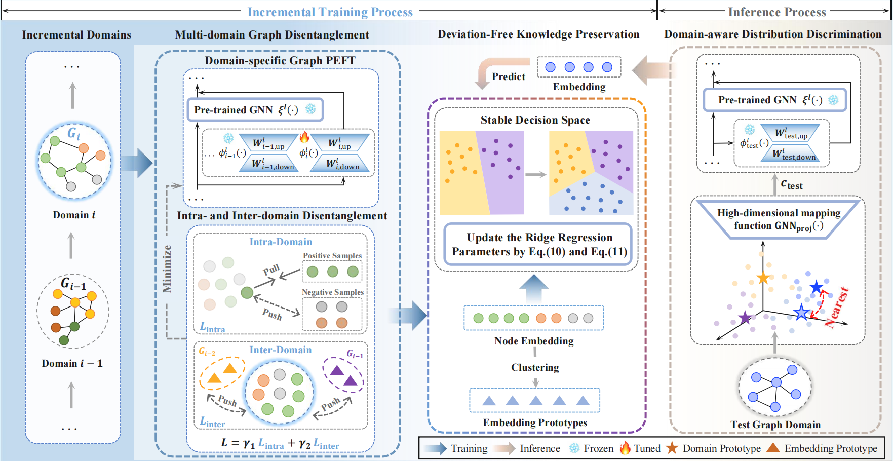

# [NeurIPS 2025] GraphKeeper: Graph Domain-Incremental Learning via Knowledge Disentanglement and Preservation

This repository is the official implementation of "GraphKeeper: Graph Domain-Incremental Learning via Knowledge Disentanglement and Preservation" accepted by the Main Technical Track of NeurIPS-2025.

<p align="center">

</p>

### Environment

```
python==3.8.0
cuda==11.7
torch==1.7.1
DGL==0.6.1
```


### Quick Start

Unzip datas in the ROOT directory :
```
tar -xzvf datas.tar.gz
```

To train and evaluate our method, run the following command in the ROOT directory :
```
bash train_domain.sh
```

### Citation
If you find this repository helpful, please consider citing the following paper. We welcome any discussions with [guozh@buaa.edu.cn](mailto:guozh@buaa.edu.cn).

```bibtex
@article{guo2025graphkeeper,
  title={GraphKeeper: Graph Domain-Incremental Learning via Knowledge Disentanglement and Preservation},
  author={Guo, Zihao and Sun, Qingyun and Zhang, Ziwei and Yuan, Haonan and Zhuang, Huiping and Fu, Xingcheng and Li, Jianxin},
  journal={arXiv preprint arXiv:2511.00097},
  year={2025}
}
```

### Acknowledgements
Part of this code is inspired by [CGLB](https://github.com/QueuQ/CGLB) and [TPP](https://github.com/mala-lab/TPP). We owe sincere thanks to their valuable efforts and contributions.


